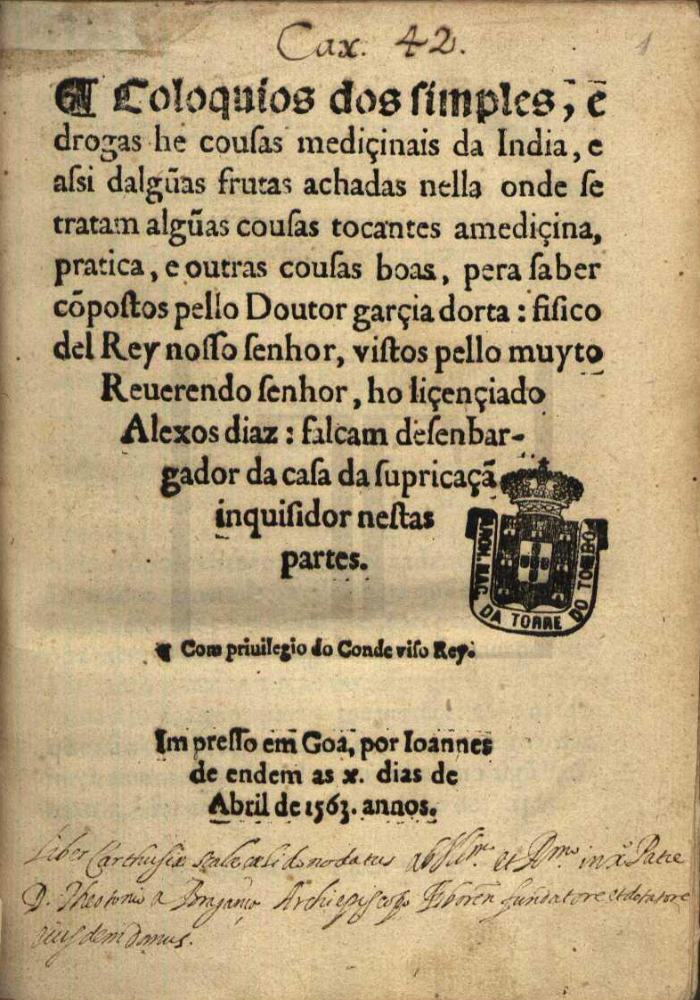

# Premodern Concordance

**A cross-linguistic entity concordance for early modern natural knowledge.**

When a Portuguese physician in 1563 Goa wrote about *canela*, a Spanish doctor in 1574 Seville about *canela*, an English herbalist in 1652 London about *Cinnamon*, and a Florentine apothecary guild in 1597 about *cannella* — they were all talking about the same thing. This project finds those connections automatically across six multilingual texts spanning three centuries, linking roughly 1,400 clusters of people, plants, substances, places, diseases, and concepts through a hybrid pipeline of fine-tuned embeddings and large language models.

The result is a searchable concordance that preserves the beautiful instability of premodern naming: every variant spelling, every long-s artifact, every Latinized physician name — cross-referenced, enriched with modern identifications, and linked to Wikidata.

---

## The Corpus

| Text | Author | Year | Language |
|------|--------|------|----------|
| *Coloquios dos Simples e Drogas da India* | Garcia de Orta | 1563 | Portuguese |
| *Historia Medicinal de las cosas que se traen de nuestras Indias Occidentales* | Nicolas Monardes | 1574 | Spanish |
| *Ricettario Fiorentino* | Collegio Medico di Firenze | 1597 | Italian |
| *The English Physitian* | Nicholas Culpeper | 1652 | English |
| *Polyanthea Medicinal* | Joao Curvo Semedo | 1741 | Portuguese |
| *Relation historique du voyage, Tome III* | Alexander von Humboldt | 1825 | French |

These texts were chosen for their overlapping concern with materia medica, pharmacy, botany, and natural history — and for the challenge their linguistic diversity poses to any system that would try to link them.

---

## What It Does

```
"Avicena" (Orta, 1563)  ←→  "Auicena" (Semedo, 1741)  ←→  "Avicen" (Culpeper, 1652)
     │                              │                              │
     └──────────────── Avicenna (Ibn Sina, c. 980–1037) ───────────┘
                        Q8011 · Persian polymath
```

The concordance links entities across books and languages through embedding similarity, producing clusters like the one above. Each cluster is enriched with:

- **Modern identification** — Linnaean binomials for plants/animals, birth/death dates for people, modern medical terms for diseases
- **Wikidata linking** — structured identifiers, descriptions, and Wikipedia article URLs
- **Semantic glosses** — thematic descriptions grounded in how the entity actually appears in these texts (not how Wikipedia describes it in 2026)
- **Full provenance** — every variant spelling, every source text excerpt, every cross-book similarity score

---

## At a Glance

| | |
|---|---|
| Concordance clusters | **1,422** |
| Source texts | **6** (in 5 languages) |
| Entity categories | **8** (Person, Plant, Animal, Substance, Place, Disease, Concept, Object) |
| Total mentions | **40,000+** |
| Wikidata-linked | **66%** of clusters |
| Linnaean-identified | **16%** of clusters (biological entities) |
| Pipeline scripts | **14** Python scripts (~4,000 lines) |
| Web interface | **8** routes in Next.js (~4,500 lines TypeScript) |

---

## The Pipeline

The concordance is built through an eight-stage pipeline. Each stage is a standalone Python script that reads JSON and writes JSON, making the process auditable, resumable, and individually re-runnable.

```
  ┌─────────────┐     ┌──────────────┐     ┌──────────────┐     ┌──────────────┐
  │  1. Extract  │────▶│ 2. Dedup     │────▶│ 3. Fine-Tune │────▶│ 4. Match     │
  │  (Gemini)    │     │ (BGE-M3)     │     │ (BGE-M3)     │     │ (BGE-M3)     │
  └─────────────┘     └──────────────┘     └──────────────┘     └──────────────┘
                                                                        │
  ┌─────────────┐     ┌──────────────┐     ┌──────────────┐     ┌──────────────┐
  │  8. Index    │◀────│ 7. Enrich    │◀────│ 6. Verify    │◀────│ 5. Cluster   │
  │  (OpenAI)   │     │ (Gemini+WD)  │     │ (Gemini)     │     │ (graph)      │
  └─────────────┘     └──────────────┘     └──────────────┘     └──────────────┘
```

| Stage | Script | What It Does | Model |
|-------|--------|-------------|-------|
| **1. Extract** | `extract_book_entities.py` | LLM-based NER on chunked source text (2,500-char chunks, 200-char overlap) | Gemini 2.5 Flash Lite |
| **2. Deduplicate** | `dedup_entities.py` | Merge within-book duplicates via embedding similarity + graph clustering | Fine-tuned BGE-M3 |
| **3. Fine-Tune** | `finetune_embeddings.py` | Contrastive learning on ~500 historical name pairs | BAAI/bge-m3 base |
| **4. Match** | `match_cross_book_entities.py` | Pairwise cross-book entity matching with category/subcategory constraints | Fine-tuned BGE-M3 |
| **5. Cluster** | `build_concordance.py` | Connected-component clustering + validation + near-duplicate merging | Fine-tuned BGE-M3 |
| **6. Verify** | `verify_concordance.py` | LLM review of suspicious clusters (flagged by heuristics) | Gemini 2.5 Flash Lite |
| **7. Enrich** | `enrich_concordance.py` | Ground truth ID + Wikidata linking + semantic glosses | Gemini 2.5 Flash Lite |
| **8. Index** | `build_search_index.py` | Semantic search embeddings (512-dim) for the web interface | OpenAI text-embedding-3-small |

### Why Fine-Tune?

Off-the-shelf multilingual embeddings don't understand that *Riverius* and *Lazzaro Riviera* are the same person, or that *eſtomago* is just *estomago* with a long-s. Fine-tuning BGE-M3 on ~500 curated historical name pairs improved cross-lingual matching from **26.7%** to **91.1%** of pairs achieving >= 0.8 similarity. The biggest single-pair improvement was +0.66 on "Riverius" / "Lazzaro Riviera."

---

## Web Interface

The frontend is a Next.js 16 application with a Swiss-inspired design vocabulary: gap-pixel grids, systematic typography, horizontal rule dividers, and generous whitespace.

### Pages

- **/** — Home with interactive multilingual title, search, and example clusters
- **/books** — Corpus browser with cover images and metadata
- **/books/[id]** — Full-text reader with entity highlighting and excerpts
- **/books/[id]/entity/[entityId]** — Entity detail with click-to-translate excerpts
- **/concordance** — Complete concordance browser with search, category/book filters, expandable cluster cards with Wikipedia thumbnails and cross-book similarity edges
- **/search** — Hybrid semantic + lexical search (OpenAI embeddings + Levenshtein/substring matching)
- **/methodology** — Detailed pipeline documentation with floating navigation
- **/about** — Project information and colophon

### API Routes

- **`/api/search`** — Hybrid search: embeds query via OpenAI, computes cosine similarity against all 1,422 clusters, blends with lexical scoring
- **`/api/translate`** — Click-to-translate excerpts from early modern Portuguese/Spanish/French/Italian/Latin to English via Gemini 2.5 Flash Lite

---

## Running Locally

### Web Interface

```bash
cd web
npm install
cp .env.local.example .env.local  # Add your API keys
npm run dev
```

Required environment variables:
```
OPENAI_API_KEY=sk-...     # For /api/search (semantic embeddings)
GEMINI_API_KEY=AIza...    # For /api/translate (excerpt translation)
```

The app runs at `http://localhost:3000`. All data is pre-built in `web/public/data/` — you don't need to run the pipeline to use the web interface.

### Pipeline (Optional)

The Python scripts require a virtual environment with the dependencies from the `scripts/` directory. The fine-tuned model (~4 GB) is not included in the repository and must be trained locally or obtained separately.

```bash
python -m venv .venv
source .venv/bin/activate
pip install sentence-transformers google-genai openai python-dotenv numpy
```

Each script is standalone and reads/writes to `web/public/data/`. See the [Methodology page](web/src/app/methodology/page.tsx) for detailed documentation of each stage.

---

## Deployment

The project deploys to Vercel. The `vercel.json` at the root points to `web/` as the root directory.

1. Connect the GitHub repo to Vercel
2. Add `OPENAI_API_KEY` and `GEMINI_API_KEY` as environment variables in **Settings > Environment Variables**
3. Deploy

The static data files in `web/public/data/` are served directly by Vercel's CDN.

---

## Project Structure

```
.
├── books/                    # Source text files (plain text)
├── data/                     # Training pairs for fine-tuning
├── notebooks/                # Colab notebooks for fine-tuning
├── pilot/                    # Early prototyping and experimentation
├── scripts/                  # 14 Python pipeline scripts
│   ├── extract_book_entities.py
│   ├── dedup_entities.py
│   ├── finetune_embeddings.py
│   ├── match_cross_book_entities.py
│   ├── build_concordance.py
│   ├── verify_concordance.py
│   ├── enrich_concordance.py
│   ├── enrich_semantic_tags.py
│   ├── build_search_index.py
│   └── ...
├── vercel.json               # Vercel deployment config
└── web/                      # Next.js 16 application
    ├── public/
    │   ├── data/             # Pre-built concordance + search index
    │   ├── images/           # Book cover images
    │   └── texts/            # Source texts for full-text reader
    └── src/app/
        ├── page.tsx          # Home
        ├── books/            # Book browser + reader + entity detail
        ├── concordance/      # Full concordance browser
        ├── search/           # Semantic search
        ├── methodology/      # Pipeline documentation
        ├── about/            # Project info
        └── api/              # Search + translate endpoints
```

---

## Known Limitations & Future Work

- **Corpus size.** Six texts is a proof of concept. The pipeline is designed to scale to dozens of texts, but matching complexity grows quadratically with corpus size.
- **OCR quality.** Some source texts have significant OCR noise. The pipeline handles common patterns (long-s, ligatures) but unusual corruptions may slip through.
- **Subcategory sensitivity.** Entity embeddings include subcategory context, which can split genuine matches when the LLM assigns different subcategories to the same entity in different chunks. The near-duplicate merge partially addresses this.
- **One-to-one matching.** The constraint that each entity matches at most one entity per book prevents attractor entities but can miss genuine many-to-one relationships (e.g., multiple entries for variants of cinnamon that should all link to the same cluster).

---

## Acknowledgments

Built by [Benjamin Breen](https://benjaminbreen.com) (UC Santa Cruz) and Mackenzie Cooley (Hamilton College).

Web interface and pipeline code developed with assistance from [Claude Code](https://claude.ai/claude-code) (Claude Opus 4.5/4.6).

Models: [BAAI/bge-m3](https://huggingface.co/BAAI/bge-m3) (fine-tuned), [Gemini 2.5 Flash Lite](https://ai.google.dev/), [OpenAI text-embedding-3-small](https://platform.openai.com/docs/guides/embeddings).

Typography: System UI, [UnifrakturMaguntia](https://fonts.google.com/specimen/UnifrakturMaguntia), [EB Garamond](https://fonts.google.com/specimen/EB+Garamond), [Space Grotesk](https://fonts.google.com/specimen/Space+Grotesk).

---

<sub>A cross-linguistic concordance of early modern natural knowledge. Because *canela* is *cannella* is *cinnamon* is *Cinnamomum verum* J.Presl — and has been since 1563.</sub>
